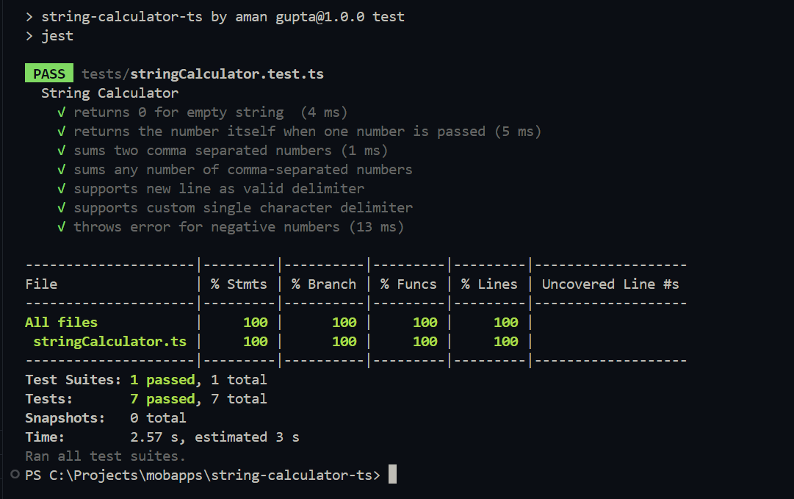

#  String Calculator – TDD Kata (TypeScript)

This project is a TDD-based implementation of the **String Calculator Kata** . It demonstrates test-driven development, clean modular code, and proper commit practices.

---

##  Features Implemented

- Return `0` for an empty string
- Return the number itself when a single number is passed
- Add two or more comma-separated numbers
- Support new line (`\n`) as a delimiter
- Support a custom delimiter (e.g. `//;\n1;2`)
- Throw error for negative numbers with list of all negatives

---

##  Example Usage

```ts
add("");             // 0
add("4");            // 4
add("1,2,3");        // 6
add("1\n2,3");       // 6
add("//;\n1;2");     // 3
add("1,-2");         // throws Error("negative numbers not allowed: -2")
```

---

## 🔧 Setup & Run Instructions

### 1. Install dependencies
```bash
npm install
```

### 2. Run all tests
```bash
npm test
```

### 3. Compile TypeScript
```bash
npm run build
```

### 4. Run compiled code
```bash
node dist/src/stringCalculator.js
```

> You can also use `npx ts-node src/stringCalculator.ts` for direct TS execution.

---

## 🧪 Sample Test Output

```bash
PASS  tests/stringCalculator.test.ts
✓ returns 0 for empty string
✓ returns the number itself when one number is passed
✓ sums two comma separated numbers
✓ sums any number of comma-separated numbers
✓ supports new line as valid delimiter
✓ supports custom single character delimiter
✓ throws error for negative numbers
```

---

## 🗂️ Project Structure

```
string-calculator-ts/
├── assets/
│ └── test-output.png
├── src/
│ └── stringCalculator.ts
├── tests/
│ └── stringCalculator.test.ts
├── jest.config.js
├── tsconfig.json
├── package.json
├── .gitignore
└── README.md

---

## 📓 TDD Commit Guidelines

Every commit follows the red-green-refactor cycle:

- Add failing test
- Make it pass with minimal implementation
- Refactor for clarity and modularity
-  Commit after each meaningful step

---

## About

Built by **Aman Gupta** using **TypeScript**, **Jest**, and **TDD** principles.

---


## 📸 Screenshot 

